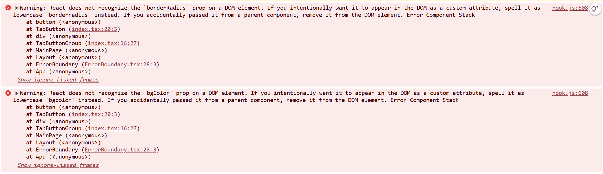
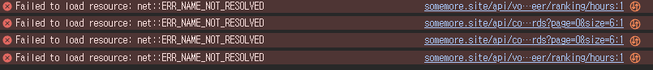

# 🦺 구호활동 연결 플랫폼 손모아

재해나 지원이 필요한 현장에서 도움을 원하는 단체와 자원봉사자를 연결해주는 중계 플랫폼입니다.

배포 URL: https://www.somemore.site/ <br />
노션 링크: https://www.notion.so/prgrms/Team08-81045d7e1f3e48ccbb9b215a663b97c6 <br />

## 🎇프로젝트 개요

**손모아**의 목표는 **"사회지원 활동 참여를 쉽게 만들자"** 입니다.<br />

전화, 방문 등 기존의 복잡한 절차의 불편함을 해소해 접근성을 향상 시키기 위해 이 프로젝트를 기획하게 되었습니다.   <br />

도움이 필요하지만 모집 방법이 게시글 등록이 전부였던 기관들에게 봉사자에게 직접 도움을 요청할 수 있게 하여 봉사자와 기관 간의 커뮤니케이션을 활성화할 수 있고, <br />
봉사 시간에 따라 티어를 부여하고 "이 주의 봉사왕" 랭킹과 같은 게이미피케이션(Gamification)을 통해 봉사자들은 성취감을 느낄 수 있습니다.

## 📃목차

- [프로젝트 개요](#프로젝트-개요)
- [프로젝트 구성원](#프로젝트-구성원)
- [주요 기능](#주요-기능)
- [기술 스택](#기술-스택)
- [폴더 구조](#폴더-구조)
- [설치 및 실행 방법](#설치-및-실행-방법)
- [개발 기간](#개발-기간)
- [트러블 슈팅](#트러블-슈팅)
- [향후 개선 사항](#향후-개선-사항)
- [팀원 소개 및 느낀점](#팀원-소개-및-느낀점)

## 👩🏻‍💻프로젝트 구성원

|                Frontend                |                Frontend                |                Frontend                |
| :-----------------------------------: | :------------------------------------: | :------------------------------------: |
|              **홍유진(팀장)**               |              **김민준**               |              **김주영**               |
| [ <br/> @youjin-hong](https://github.com/youjin-hong) | [ <br/> @minjoon97](https://github.com/minjoon97) | [ <br/> @djm06294](https://github.com/djm06294) |

## 💡주요 기능

### ✔️메인 기능

- **기관**은 봉사 활동에 대한 모집글을 등록할 수 있습니다.


<br />

- **봉사자**는 기관들이 올린 봉사 활동 모집글들을 전부 볼 수 있고, 원하는 봉사 활동 모집글에 대해 지원할 수 있습니다.


<br />

- **기관**은 자신이 올린 봉사 활동에 지원한 봉사자들의 명단을 리스트로 관리하며 지원 수락, 반려할 수 있습니다.


<br />

- **기관**은 해당 봉사 활동이 종료된 후, 봉사 활동에 참여한 지원자들에 한하여 봉사 시간을 정산할 수 있습니다. 


<br />


### ✔️콘텐츠 기능

- 메인 페이지에는 봉사자들의 프로필에 등록돼있는 봉사 시간을 기준으로 "이 달의 봉사왕" 봉사시간이 많은 봉사자 4명의 랭킹이 매겨집니다.


<br />

- 각 봉사자들은 봉사 시간/횟수에 따라 10단계의 티어를 가질 수 있습니다.


<br />

- 기관과 봉사자는 모두 커뮤니티를 공유하며, 댓글과 대댓글 기능을 통해 활발한 소통을 할 수 있습니다. 


<br />


### ✔️편의 기능

- 기관은 봉사자에게, 봉사자는 기관에게 쪽지를 전달할 수 있습니다. 이를 통해 기관과 봉사자의 소통에 편의를 보장합니다. 


<br />

- 기관과 봉사자 모두 쪽지, 리뷰, 봉사 신청 결과 등을 실시간 알림으로 받아볼 수 있습니다. 


<br />

## 🛠기술 스택

### 📌 Frontend Tech Stack

#### 🔤 언어
<div style={{display: "flex"}}>


</div>

#### 🛠 프레임워크
<div style={{display: "flex"}}>


</div>

#### 📡 상태 관리 & 데이터 통신
<div style={{display: "flex"}}>


</div>

#### 🔌 외부 라이브러리 & 서비스
<div style={{display: "flex"}}>


</div>


### 🤝 협업 Tool
<div style={{display: "flex"}}>


</div>

<br />

## 📁폴더 구조

<details>
  <summary>디렉토리 구조 (FSD 아키텍처)</summary>
<pre><code>
src
├── assets
│   └── images
├── components
│   ├── component1
│   │   ├── logic
│   │   ├── ui
│   │   ├── index.tsx
│   │   └── indexCss.ts
│   └── component2
│       ├── logic
│       ├── ui
│       ├── index.tsx
│       └── indexCss.ts
├── features
│   ├── feature1
│   │   ├── logic
│   │   ├── ui
│   │   ├── index.tsx
│   │   └── indexCss.ts
│   └── feature2
│       ├── logic
│       ├── ui
│       ├── index.tsx
│       └── indexCss.ts
├── api
│   ├── endPoints.ts
│   └── client.ts
├── store
│   ├── queries
│   │   └── login
│   │       └── loginData.ts
│   └── stores
├── styles
│   ├── myreset.css
│   └── global.css
├── shared
│   ├── hooks
│   └── types
├── mocks
├── pages
│   ├── main-page
│   │   ├── index.tsx
│   │   └── indexCss.ts
│   └── login-page
│       ├── index.tsx
│       └── indexCss.ts
└── layout
    ├── header
    └── footer
</code></pre>
</details>

<br />

## 🔄 User Flow


**주요 사용자 흐름**<br />

1. 비로그인 사용자(기관/봉사자 구분 x): 봉사 활동 모집글/커뮤니티/메인페이지 이용 가능
2. 기관: 도움요청글 작성/수정/삭제, 지원자 수락/반려/정산, 커뮤니티 글 작성/삭제/댓글, 쪽지/리뷰, 알림, 마이페이지 이용
3. 봉사자: 도움요청글 조회/지원/지원 철회, 커뮤니티 글 작성/삭제/댓글, 쪽지/리뷰, 알림, 마이페이지 이용

<br />


## 🚀설치 및 실행 방법

### 설치

1. **저장소 복제하기**

```
git clone https://github.com/prgrms-web-devcourse-final-project/WEB1_1_Bongdari_FE.git

```
2. **프론트엔드 종속성 설치**

```
yarn install
```

3. **환경 변수 설정**

- frontend: 백엔드 도메인 주소, 카카오맵 api Javascript key 등록

4. **개발 서버 시작**
```
yarn dev
```

<br />

## 📆개발 기간

- 기획: 2024.11.12~2024.11.25
- 개발: 2024.11.25~ing

<br />

## 🛠트러블 슈팅
<details>
  <summary>DOM으로 불필요한 props가 전달되는 문제</summary>
    <div markdown="1">
    <ul>
      <div>

## ✉️ 오류 메시지



## 📃 문제 상황

CSS-in-JS 인 `styled-components`를 사용하여 props로 사용자 정의 스타일 속성을 넘겨주며 작업하다 아래와 같은 경고 메세지를 겪게 되었다. 

첫 번째 문제는 React는 DOM 요소로 `borderRadius`, `bgColor` props를 인식하지 못하고 있었고, 

두 번째 문제는 이 속성들을 각각 `borderradius`, `bgcolor`로 변경할 것을 권하고 있었다. 

## 🤔 에러가 발생한 이유

렌더링은 잘 되지만 콘솔에 경고 메세지가 뜨는게 거슬려서 이들을 다 소문자로 바꿔주었으나, 오류 메세지는 해결되지 않아서 찾아 보았더니,

 `React`가 HTML DOM(위의 메시지에서는 `<button>` 태그)에 전달되지 않아야 할 사용자 정의 props(위의 메시지에서 `borderRadius`, `bgColor`등)가 전달돼 발생한다는 것을 알게 되었다. 

## 🧠 해결 과정

`React`는 기본적으로 HTML 표준 속성만 DOM에 렌더링 하며, 사용자 정의 속성은 DOM으로 전달되면 HTML 표준 속성이 아니라서 `React`가 인식을 하지 못 해 경고를 발생시킨다고 한다. 
이 렌더링은 되지만, 이러한 경고를 해결하기 위해서는 `styled-components`에서 필요한 props만 필터링하여 DOM에 전달되도록 처리해야 한다고 한다. 

# 💡 해결 방법

현재 우리 프로젝트에서 사용하는 버전은 `v6.1.13`이고, 공식 문서에 따르면 `v5.1` 이상부터 **`shouldForwardProp`을 권장**한다고 한다. (공식문서**:** https://styled-components.com/docs/api)

이 옵션을 사용하면 DOM에 전달하지 않을 props를 필터링할 수 있다고 한다. 

## 🛠️ 수정

그래서 아래의 코드를 다음과 같이 바꿔주었다. 

- 변경 전
    
    ```jsx
    import styled from 'styled-components';
    
    const TabButtonComponent = styled.button<{
      border: string;
      borderRadius: string;
      fontSize: string;
      bgColor: string;
      color: string;
      width: string;
      height?: string;
      disabled?: boolean;
    }>`
      border: ${({ border }) => border || '1px solid #DFDFDF'};
      border-radius: ${({ borderRadius }) => borderRadius || '10px'};
      font-size: ${({ fontSize }) => fontSize || '16px'};
      background-color: ${({ bgColor }) => bgColor || '#2382FF'};
      color: ${({ color }) => color || '#848484'};
      width: ${({ width }) => width || '167px'};
      height: ${({ height }) => height || '47px'};
    
      font-weight: 600;
      cursor: pointer;
    `;
    
    export default TabButtonComponent;
    ```
    
- 변경 후(`shouldForwardProp` 적용)
    
    ```jsx
    import styled from 'styled-components';
    
    const TabButtonComponent = styled.button.withConfig({
      shouldForwardProp: (prop) =>
        !['border', 'borderRadius', 'fontSize', 'bgColor', 'color', 'width', 'height', 'disabled'].includes(prop)
    })<{
      border?: string;
      borderRadius?: string;
      fontSize?: string;
      bgColor?: string;
      color?: string;
      width?: string;
      height?: string;
    }>`
      border: ${({ border }) => border || '1px solid #DFDFDF'};
      border-radius: ${({ borderRadius }) => borderRadius || '10px'};
      font-size: ${({ fontSize }) => fontSize || '16px'};
      background-color: ${({ bgColor }) => bgColor || '#2382FF'};
      color: ${({ color }) => color || '#848484'};
      width: ${({ width }) => width || '167px'};
      height: ${({ height }) => height || '47px'};
    
      font-weight: 600;
      cursor: pointer;
    `;
    
    export default TabButtonComponent;
    ```
    </div>
    </ul>
  </div>
</details>
<details>
  <summary>모달 열었을 때, 모달 뒤의 브라우저 이벤트 막기</summary>
    <div markdown="2">
    <ul>
      <div>

## 📃 문제 상황

모달을 열었을 때 모달 뒤의 body에서 클릭, 스크롤 등이 일어나는 이벤트를 막아줘야 해서 조건문과 useEffect를 이용해 isOpen === true일 때 body의 스크롤을 막고, 그 외에 경우에는 막는 속성을 제거해주는 코드를 작성해줬는데, 위의 사진처럼 모달을 열고 닫았을 때 body의 스크롤 이벤트가 제거된 상태인 문제 상황이 나타났다.

```bash
// 문제 상황이 일어난 코드
import { useEffect } from 'react';
import { ModalWrapper, ModalContainer, CloseButton } from './indexCss';

interface ModalProps {
  isOpen: boolean;
  onClose: () => void;
  variant: 'big' | 'small';
  children?: React.ReactNode;
}

const Modal = ({ isOpen, onClose, variant, children }: ModalProps) => {
  useEffect(() => {
    if (isOpen) document.body.style.overflow = 'hidden';
    else document.body.style.removeProperty('overflow');
  }, [isOpen]);

  if (!isOpen) return null;

  // 모달 내부 클릭 시 이벤트 버블링 방지
  const handleModalClick = (e: React.MouseEvent) => {
    e.stopPropagation();
  };

  return (
    <ModalWrapper onClick={onClose}>
      <ModalContainer variant={variant} onClick={handleModalClick}>
        {children}
        <CloseButton onClick={onClose}>
          <i className="fa-solid fa-x"></i>
        </CloseButton>
      </ModalContainer>
    </ModalWrapper>
  );
};

export default Modal;
```

## 🤔 에러가 발생한 이유

**문제1: 스크롤 위치 손실**

- `overflow-hidden`을 설정해서 모달을 열었을 때 스크롤을 잠그려고 했는데, 이 속성을 사용하면 사용자가 현재 스크롤 중이라면 모달을 닫을 때 이전 스크롤 위치를 복원하지 않는다고 한다.

**문제2: `removeProperty` 가 제대로 동작 안함**

- `removeProperty` 로 overflow 스타일을 삭제하려 했는데, body에 적용된 다른 속성에 의해 이 속성이 body에 적용이 안된 것 같았다.

## 🧠 해결 과정

위의 방법대로 했을 땐 브라우저의 스크롤 자체가 사라지며 페이지가 살짝 움직이는  layout shift 현상을 해결하기 위해 브라우저의 바깥 너비, 내부 너비를 계산해 스크롤바의 너비를 구하여 모달이 열렸을 때 padding 값을 브라우저에 주어 너비가 바뀌어 보이는 현상을 제거하고 모달을 열고 닫았을 때 스크롤 했던 위치를 기억하고 복원하는 훅을 만들어 Modal 컴포넌트에 적용해보았다. 

# 💡 해결 방법

---

```bash
import { useCallback, useEffect } from 'react';

// 뒤의 스크롤이벤트를 없앨 경우, body의 스크롤바가 사라지면서 스크롤바가 차지하던 공간이 없어져
//  너비가 바뀌거나 페이지가 살짝 움직이는 현상을 방지하기 위해
// 브라우저의 스크롤바 너비를 계산하는 함수를 만들었습니다. -> 너비만큼 padding-right를 추가하기 위한 작업
// 이렇게 하면 어제 멘토님께서 말씀하신 layout shift 현상을 방지할 수 있습니다.
const getScrollbarWidth = () => {
  // 보이지 않는 외부 div 생성
  const outer = document.createElement('div');
  outer.style.visibility = 'hidden';
  outer.style.overflow = 'scroll';
  document.body.appendChild(outer);

  // 보이지 않는 내부 div 생성
  const inner = document.createElement('div');
  outer.appendChild(inner);

  // 스크롤바 너비 = 외부 div 너비 - 내부 div 너비
  const scrollbarWidth = outer.offsetWidth - inner.offsetWidth;
  // DOM에 사용된 outer를 삭제하고 스크롤바 너비 계산한 값만 남김
  outer.parentNode?.removeChild(outer);

  return scrollbarWidth;
};

const useScrollLock = (isOpen: boolean) => {
  // 스크롤 잠금 로직을 메모이제이션 -> 불필요한 재생성 방지
  const lockScroll = useCallback(() => {
    // 현재 스크롤 위치 저장하는 변수
    const scrollY = window.scrollY;
    const body = document.body;

    // 현재 body의 스타일을 객체로 저장
    const originalStyle = {
      position: body.style.position,
      top: body.style.top,
      overflow: body.style.overflow,
      width: body.style.width,
      paddingRight: body.style.paddingRight
    };

    // 모달 열렸을 떄, body에 새로운 스타일 저장. 이 때 padding-right를 채워 너비 변동 방지
    body.style.cssText = `
      position: fixed;
      top: -${scrollY}px;
      overflow-y: scroll;
      width: 100%;
      padding-right: ${getScrollbarWidth()}px;
    `;

    // cleanup 함수
    return () => {
      Object.assign(body.style, originalStyle); // 모달 닫으면 원래 스타일로 복원
      window.scrollTo(0, scrollY); // 모달 닫으면 원래 스크롤 위치로 복원
    };
  }, []);

  // isOpen === true일 떄만 스크롤 잠금 적용
  useEffect(() => {
    if (isOpen) {
      const unlock = lockScroll(); // isOpen일 때만 잠금 실행
      return unlock; // 컴포넌트 unmount 되거나 !isOpen일 때 잠금 해제
    }
  }, [isOpen, lockScroll]);
};

export default useScrollLock;
```

팀원들과 미래의 내가 보기 편하게 주석을 코드마다 달아놓았다. 

`getScrollbarWidth`  함수로 스크롤바 너비를 계산하고 `useScrollLock` 훅 함수를 만들어 안에 

`useCallback` 을 사용해 현재 body에 적용된 속성들을 기억하는 `originalStyle`을 객체로 만들어 저장하고, 모달을 열었을 때 적용될 속성들을 getScrollbarWidth를 사용해 만들어주었다. 

그리고 cleanup 함수를 통해 모달을 닫았을 때 이전에 저장된 원래 스타일대로 복원하는 작업도 해주었다.
      </div>
    </ul>
  </div>
</details>
<details>
  <summary>백엔드 API 연결 안됨 (MSW 도입 과정)</summary>
    <div markdown="3">
    <ul>
      <div>



## 📃 문제 상황

새로 배정받은 AWS 계정으로 프론트와 백을 각각 다시 배포하여 https 도메인을 얻어 개발을 하던 중, API 연결이 됐다가 안됐다가 하는 가챠하는 것 같은 상황이 발생했다. (누구는 되고 누구는 안되고,, 🥲)

## 🤔 에러가 발생한 이유

프론트 배포까지 백엔드에서 맡아서 해주셔서(정말 감사합니다) 원인은 잘 모르지만, 프론트와 백 도메인을 같이 쓰게 됐는데 여기서 요청이 백엔드로 잘 안가고 중간에 엉킨 것 같다고 하셨다. 

## 🧠 해결 과정

배포를 직접하지 않아 이 원인에 대해 해결책은 찾지 못했지만, 테스트를 해보며 개발을 해야 하는데 연결을 해야 하는 페이지가 많이 남았기 때문에 무작정 기다리고 있을 수만은 없어서 잠시 worker.stop() 해놓았던 msw를 다시 가동시켜 쓰기로 결정했다. 

# 💡 해결 방법

---

우선, `main.tsx`에서 작동 중지 시켜놨던 msw worker를 작동 시켰다. 

```jsx
import { createRoot } from 'react-dom/client';
import App from './App.tsx';

async function enableMocking() {
  if (!import.meta.env.DEV) {
    return;
  }

  const { worker } = await import('@/mocks/browser.ts');

  return worker.start({
    onUnhandledRequest: 'bypass'
  });

  // worker.stop();
}

enableMocking().then(() => {
  createRoot(document.getElementById('root')!).render(<App />);
});
```

그 다음 mock 폴더의 핸들러에 api 명세에 맞게 get, post 필요한 핸들러를 작성해주었다. 

```jsx
import { http, HttpResponse } from 'msw';

// post 요청 body 타입 정의
interface PreferItemRequest {
  item_name: string;
}

export const centerHandlers = [
  http.get('https://somemore.site/api/center/profile/:centerId', ({ params }) => {
    const { centerId } = params;

    // 기관 프로필 get
    return HttpResponse.json({
      code: 200,
      message: '조회 성공',
      data: {
        center_id: centerId,
        name: '서울 도서관',
        contact_number: '010-1234-5678',
        img_url:
          'https://png.pngtree.com/png-clipart/20190614/original/pngtree-company-business-business-company-friendly-man-greeting-man-png-image_3785135.jpg',
        introduce: '서울 도서관을 소개해요',
        homepage_link: 'https://fitnesscenter.com',
        prefer_items: [
          {
            id: 1,
            centerId: 'B84733D0-AE17-11EF-AA15-0A855994FB4B',
            itemName: '도서 10권'
          },
          {
            id: 2,
            centerId: 'B84733D0-AE17-11EF-AA15-0A855994FB4B',
            itemName: '옷 10벌'
          }
        ]
      }
    });
  }),

  // 기관 마이페이지 선호물품 post
  http.post('https://somemore.site/api/preferItem', async ({ request }) => {
    const requestData = (await request.json()) as PreferItemRequest;

    return HttpResponse.json({
      code: 200,
      message: '요청 성공',
      data: {
        id: 111,
        center_id: 'B84733D0-AE17-11EF-AA15-0A855994FB4B',
        item_name: requestData.item_name
      }
    });
  })
];
```

그 다음 handlers/index.tsx에 핸들러 내보내기를 하고..

```jsx
// 요청을 지연시킬 수 있는 유틸리티 함수 -> api 응답을 시뮬레이션할 때 사용
import { delay } from 'msw';

// 핸들러 불러오기
import { centerProfileHandlers } from './centerProfile-handler.mock';
import { preferItemHandlers } from './preferItemHandler.mock';
import { centerHandlers } from './center.mock';

// 개발 환경에서만 작동하는 지연 함수
export const delayForDevelopment = async (ms = 1000) => {
  if (import.meta.env.NODE_ENV === 'development') {
    await delay(ms);
  }
};

// 배열 안에 mock-data 안에 있는 핸들러 spread 연산자로 불러오기
export const handlers = [...centerProfileHandlers, ...preferItemHandlers, ...centerHandlers];
```

이렇게 작성을 해준 다음에 원래대로 api 호출을 하고 개발을 하면

```jsx
import { useQuery } from '@tanstack/react-query';
import axiosInstance from '@/api/apis';

export interface PreferItem {
  id: number;
  centerId: string;
  itemName: string;
}

interface CenterProfile {
  centerId: string;
  name: string;
  contact_number: string;
  homepage_link: string;
  introduce: string;
  img_url?: string;
  prefer_items: PreferItem[];
}

// 기관 프로필 get 해오는 fetch 함수
const fetchCenterProfile = async (centerId: string): Promise<CenterProfile> => {
  const response = await axiosInstance.get(`/api/center/profile/${centerId}`);

  console.log('기관프로필 get 결과: ', response.data);

  return response.data;
};

// TODO: 기관 프로필 수정 put 만들어야 함

export const useGetCenterProfile = (centerId: string) => {
  return useQuery({
    queryKey: ['centerProfile', centerId],
    queryFn: () => fetchCenterProfile(centerId),
    staleTime: 1000 * 60 * 30, // 30분
    gcTime: 1000 * 60 * 60 // 1시간
  });
};
```
.png>)
.png>)
      </div>
    </ul>
  </div>
</details>
<details>
  <summary>트러블 내용</summary>
    <div markdown="4">
    <ul>
      <li>슈팅 내용</li>
      <li></li>
    </ul>
  </div>
</details>
<br />

## 🔧향후 개선 사항

- TODO
- TODO
- TODO

<br />

## 👥팀원 소개 및 느낀점

<details>
  <summary>김민준</summary>
    <div markdown="1">
    <ul>
      <li>api요청에서의 프론트와 백의 조율사항에 대해 많은 점을 배울 수 있었던 프로젝트 였습니다. SSE, httpOnly토큰, 에러코드 기반 디버깅 등 여러가지 이슈에 따른 커뮤니케이션의 중요성을 다시 한번 느꼈고, 그만큼 경험치도 쌓을 수 있어서 좋았습니다.</li>
      <li>프로젝트를 짧은 기간 안에 마무리 하면서, 사용자 경험 측면에서 어떤 부분이 우선순위에 있는지를 생각해 볼 수 있었던 장점도 있었지만, 그만큼 디버깅이나 최적화 측면에서는 시간이 더 있었으면 어땠을까 하는 아쉬움도 있었습니다.</li>
      <li>기술적인 회고로는, 재사용성과 확장성을 고려한 컴포넌트를 결정하는 부분이 가장 어려웠던 것 같고, 쿠키의 토큰을 관리하는 법과 zustand를 이용한 로그인정보를 저장하되, 새로고침 시 초기화를 막기위한 persist사용하는 법 등이 가장 유용했던 경험이었습니다.</li>
      <li>앞으로 반응형ui구현과 디버깅을 진행할 예정이고, 강사님의 피드백 대로 시맨틱태그와 meta태그를 이용한 SEO최적화 작업도 진행해보면 좋을 것 같습니다. </li>
    </ul>
  </div>
</details>
<details>
  <summary>김주영</summary>
    <div markdown="2">
    <ul>
      <li>발표 준비를 하면서 내가 구현한 부분의 부족한 점들이 많이 보였던 것 같다. 기획할 때 생각해두지 못한 부분들도 있었고, 디버깅이 필요한 부분들도 많았다. 결과적으로 사용자가 사용할 페이지에 필요한 기능이 어떤게 있는지 좀 더 완성본을 생각해보며 구현을 했으면 좋았을 것 같고 또 세세한 것들에 차례로 집중을 하기보다는 사용자가 필수적으로 접하는 기능들부터 구현하는게 맞구나라는 생각도 많이 들었다. 그래도 계층적인? 파일 구조로 기획하고 구현하는 과정이 좋았고 프로젝트를 하나씩 해나갈 때마다 많이 배울 수 밖에 없는 것 같다. 코드 디버깅 및 리팩토링 진행하고 seo도 측정해보고 lighthouse도 사용해보며 테스트해보고 싶다.</li>
    </ul>
  </div>
</details>
<details>
  <summary>홍유진</summary>
    <div markdown="3">
    <ul>
      <li>한 달이라는 기간동안 기획 + 디자인 + 개발까지 팀프로젝트로 하기 위해 일정 관리를 하는 것이 제일 어려웠던 것 같고, 다른 작업도 마찬가지지만 특히 api 연결을 할 때 발생하고 있는 에러에 대해 백엔드에도 상황을 전달하여 어느 부분에서 에러가 발생하고 있는지 공유하는 것이 중요하다고 느꼈다. </li>
      <li>백엔드와 협업을 하며 여러 상황에 대해 같이 고민하는 시간이 많았는데, 그때마다 어떤 상황에 어떤 걸 고려해야 하는지 감이 잘 오지 않아 의견을 잘 내지 못한 게 아쉬웠다. 그래도 다른 팀원들이 이야기하는 것을 보고, 직접 개발을 진행해보며 어떤 걸 미리 고려해야 하는지, 특정 상황에서 어떤 흐름을 이해해야 하는지 많이 배우게 된 것 같아 좋았다.</li>
      <li>팀에서 테스트를 할 땐 발견하지 못했던 사항들이 발표 피드백 통해 받을 수 있어서 피드백을 반영해서 예외 처리를 하면 더 완성도 있는 결과물을 낼 수 있을 것 같다.</li>
      <li>우선 순위를 정한 뒤 개발을 시작했는데, 로그인을 해야만 개발을 할 수 있는 것들이 많아 개발이 지체가 되어서 앞으로는 로그인이 필요한 서비스에서는 로그인을 1순위로 두어야 할 것 같다고 느꼈고 이 부분은 개발자와 사용자 입장 모두 일맥상통한다고 생각이 들었다.</li>
      <li>이번에 Typescipt, react query를 처음 써서 개발을 해보았다. typescript는 단순히 type 지정만 하는 줄만 알았는데 api 요청/응답 형식, 그리고 유니온 타입, 타입 가드 등을 이용해 로직을 작성하여 좀 더 직관적이고 명확한 코드를 짤 수 있다는 것과, react query도 api fetching할 때, 캐싱이나 Optimistic update, 에러나 로딩 상태 등을 손쉽게 관리할 수 있다는 걸 알게 되었다. 이번에 사용 방법을 익혔으니 앞으로는 왜 쓰는지, 언제 적용하면 좋을 지에 대해 고민하는 시간을 가지면 좋을 것 같다.</li>
      <li>컴포넌트부터 분리를 해서 재사용성을 최대한 고민해보았는데, 컴포넌트 단에서 너무 많은 props 지정과 로직을 작성해 쓸 수 있는 상황이 제한돼 예상보다는 재사용성을 높이지 못해서 아쉬웠다.
이번 프로젝트는 컴포넌트가 제일 작은 단위였는데, 제일 작은 단위에서는 기본적인 껍데기 ui만 만드는 것이 재사용성을 높일 수 있다는 것을 느끼게 되었다.
이번에 컴포넌트를 분리하는 법에 대해 알게 되었으니 다음에는 atomic design을 도입해 개발을 진행해보고 싶다.</li>
      <li>앞으로는 기획했던 기능들을 모두 개발하고, 어제 피드백을 받았던 모바일 적응형/반응형 ui를 적용하고, 강사님/FT님/멘토님께서 말씀하신 무한스크롤 시에 throttle이 뭔지 공부하고 폰트 lazing, seo 최적화에 대해 고민하고  적용해보면 좋을 것 같다.</li>
    </ul>
  </div>
</details>